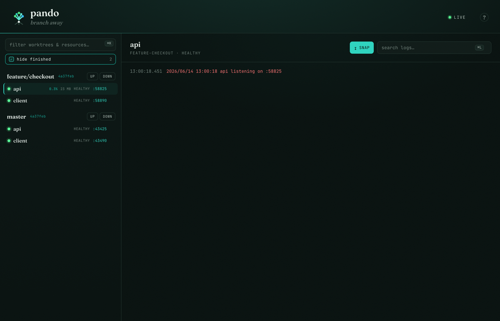

# Pando

[](https://github.com/strausslabs/pando/actions/workflows/ci.yml)
[](https://codecov.io/gh/strausslabs/pando)
[](https://github.com/strausslabs/pando/releases)
[](docs/config.md)

**Run every git worktree of a repo as one living dev environment.** One daemon
turns each worktree's `pando.star` into a set of resources — host processes,
Docker Compose services and one-shot tasks — wires them into a dependency graph,
brings them up in order, streams their logs, hot-reloads on config change, and
shows the whole grove in a web dashboard. Branch away.

<p align="center">
  
</p>

<p align="center">
  
  <br />
  <sub>The grove: every worktree and its resources, live logs, in one dashboard.</sub>
</p>

## Why

Working on three branches at once usually means three clones, three sets of
ports that collide, and three `docker compose up` terminals you forgot to stop.
Pando treats the worktrees of a single repo as first-class: each gets isolated,
auto-allocated ports (`$PORT_<name>`), its own resource graph, and shared
resources (a database, say) that come up once and are reused across branches.

- **Dependency graph, not a script.** Declare `deps`; Pando topologically orders
  startup, waits on readiness probes, and tears down in reverse.
- **Builds, not just images.** Point a resource at a `build(...)` — a Dockerfile
  `context`, `target`, `args`, build `secrets` — and Pando builds the image
  before bringing the service up.
- **Rerun on change.** `runWhen = "onChange"` reruns a task only when its watched
  globs actually change (content-hashed, debounced); `ignore` carves out the
  noise. Edit a `.go` file → rebuild fires; edit a test → it doesn't.
- **Live config.** Edit `pando.star`, save — the daemon diffs the stack and
  restarts only what changed.
- **Live update.** `sync` files into a running container and `run` a rebuild
  without a full restart.
- **Shared resources.** Mark a resource `shared` and it's brought up once for the
  whole repo, not per worktree.
- **Agent-native.** A built-in MCP server lets an AI agent inspect status, search
  logs, and drive resources. See [Agents](#agents-mcp).

## Install

```sh
brew tap strausslabs/pando https://github.com/strausslabs/pando
brew install strausslabs/pando/pando
pando setup   # optional: install the pando.star skill + register the MCP server
```

Or grab a static binary from [releases](https://github.com/strausslabs/pando/releases)
(darwin/arm64, linux/amd64, linux/arm64), or build from source with Go:

```sh
go install github.com/strausslabs/pando/cmd/pando@latest
```

`pando setup` is for agent users: it drops the `pando.star` authoring skill into
`~/.claude/skills/` and runs `claude mcp add pando -- pando mcp`. Skip it if you
don't drive Pando with an AI agent.

## Quick start

```sh
cd your-repo
$EDITOR pando.star   # describe your resources
pando up             # starts the daemon + dashboard, brings this worktree up
```

`pando up` auto-starts a per-repo daemon if one isn't already running, then
brings the worktree up. The dashboard binds a **port derived from the repo**
(7420 + an offset of the repo's identity), so every worktree of a repo shares
one dashboard and a second repo gets its own — run the same repo twice and the
per-repo socket makes the duplicate a no-op. Use `pando start` to run the daemon
in the foreground instead.

A minimal `pando.star` (Starlark — no imports, every helper is built in):

```python
define_stack(
    name = "myapp",
    services = {
        "db": service(compose = compose(image = "postgres:16", ports = ["$PORT_db:5432"])),
        "migrate": service(task = task(cmd = "./migrate"), deps = ["db"], runWhen = "once"),

        # Build the image from a Dockerfile, then run it. Live-update copies the
        # source into the running container on change — no rebuild, no recreate.
        # (The app reloads it itself, e.g. uvicorn --reload / flask debug.)
        "api": service(
            build = build(
                context = "./api",            # build context
                dockerfile = "Dockerfile.dev", # relative to context (default: Dockerfile)
                target = "dev",                # multi-stage target
                args = {"VERSION": "dev"},
            ),
            compose = compose(ports = ["$PORT_api:8000"], dependsOn = ["db"]),
            deps = ["migrate"],
            ready = http_get("http://localhost:$PORT_api/health", timeout = "30s"),
            liveUpdate = [
                sync("./api/src", "/app/src"),  # hot-copy source into the container
                run("pip install -r requirements.txt", trigger = ["./api/requirements.txt"]),  # only when deps change
                restart_container(),            # bounce the entrypoint in place — synced files survive
            ],
        ),

        # A host process that restarts whenever its sources change.
        "worker": service(
            local = cmd("go run ./cmd/worker", watch = ["**/*.go"]),
        ),

        # Rerun a task only when matching files actually change — ignore the noise.
        "build": service(
            task = task(cmd = "go build ./..."),
            runWhen = "onChange",
            onChange = ["**/*.go", "go.mod", "go.sum"],
            ignore = ["**/*_test.go"],
        ),
    },
)
```

Full syntax: **[Config reference](docs/config.md)**. Editing configs with an AI
agent? Run `pando setup` (or install the
**[pando.star skill](docs/pando-star-skill/SKILL.md)** by hand) — it teaches the
agent the syntax and how to migrate an existing setup onto Pando.

## Agents (MCP)

Pando speaks the Model Context Protocol so an agent can drive it. `pando setup`
registers it for you, or do it by hand:

```sh
claude mcp add pando -- pando mcp
```

Tools: `pando_running`, `pando_status`, `pando_logs`, `pando_logs_search`
(regex + tail), `pando_exec`, `pando_up`, `pando_down`, `pando_restart`. Each
command and the MCP server auto-discover the daemon for the current repo, so
multiple repos can run Pando at once.

## CLI

`pando up` (auto-starts the daemon) · `pando start` (foreground daemon) ·
`pando stop` (stop the repo's daemon) · `pando status` · `pando logs <resource>` ·
`pando exec <resource> -- <cmd>` · `pando restart <resource>` · `pando down` ·
`pando worktrees`. Add `--json` for machine-readable output.

## Development

Backend: `go build ./...` and `go test ./...` from the repo root. Frontend (in
`ui/`): `bun test`, `bun run typecheck`, `bun run build` (builds into
`internal/web/dist` for `go:embed`). CI runs all of this on every push to main;
a daily release auto-bumps the patch version when there are new commits.
